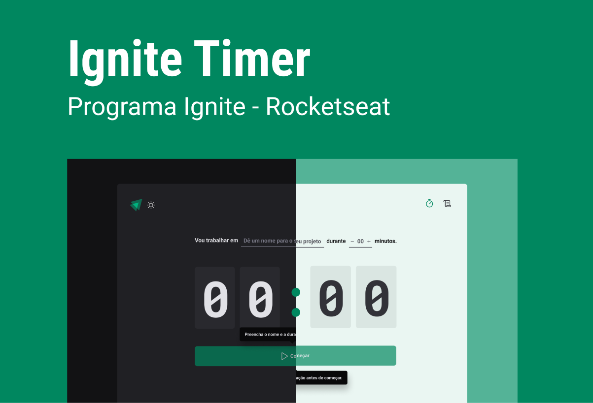
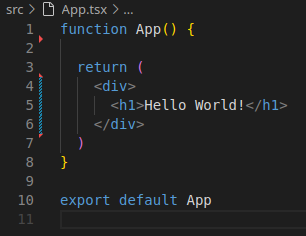
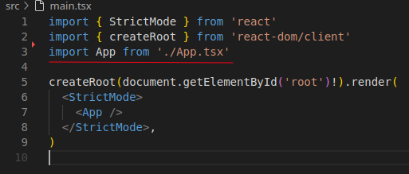
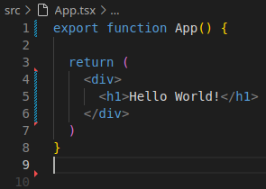
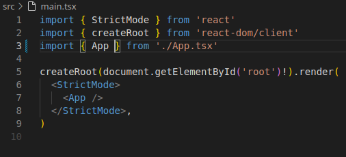
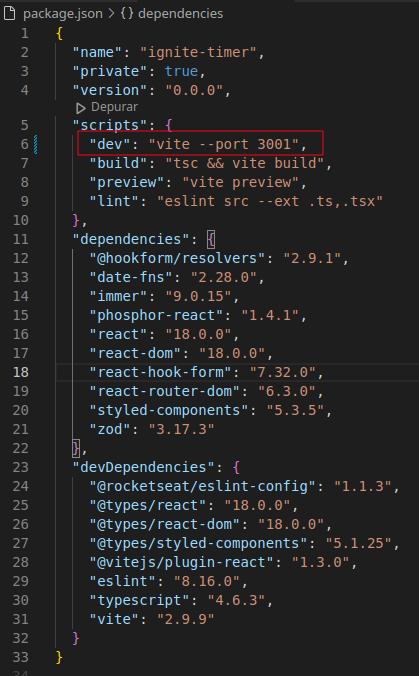

# Ignite Timer

Sistema de Pomodoro criado durante o MBA Rocketseat Full Stack.

[Projeto no Figma](https://www.figma.com/design/JIuZaE47W92sSlRBdjNvwi/Ignite-Timer-(Community)?node-id=0-1&p=f&t=trNEzTdfEJAwD3gN-0)



## Criar o projeto

```
npm create vite@latest
```

- Informar o nome do projeto;

- Escolher React;

- Escolher TypeScript;

- Abrir o diretório do projeto e editar o arquivo package.json para alterar as versões das bibliotecas de dependências para que fiquem idênticas as que foram informadas no curso, dessa forma, iremos evitar problemas de compatibilidade com versões novas;

- Abrir um terminal e digitar:

  ```
  npm install
  ```

## Remover arquivos que não iremos utilizar

- public
- src/assets
- src/App.css
- src/index.css

        Em seguida remover importações dos arquivos apagados anteriormente.

### Trocar a função de App.tsx de Default exports para Named Exports

- Default exports

  - Função

    

  - Importação

    

- Named Exports

  - Função

    

  - Importação

    

### Se necessário, altere a porta padrão do Vite




## Configurar o Eslint

- Instalar tema da Rocketseat ou outro de sua preferência.

  [Leia](https://github.com/Rocketseat/eslint-config-rocketseat/blob/main/README.md)

  ```
  npm i -D eslint @rocketseat/eslint-config
  ```

- Criar o arquivo ```.eslintrc.json``` com o seguinte conteúdo:

  ~~~
  {
    "extends": "@rocketseat/eslint-config/react"
  }
  ~~~

- Verificar erros nos arquivos manualmente

  ```
  npx eslint src --ext .ts,.tsx
  ```

- Ou habilitar a correção automática ao salvar o arquivo.

  - No Vscode ``` CRTL + SHIFT + P``` e abrir a opção **Preferências: Abrir Configurações do Usuário (JSON)** ou **Preferences: Open User Settings (JSON)**.

  - Alterar a propriedade ```"eslint.autoFixOnSave":``` para **true**

  - Corrigir todos os arquivos da aplicação automaticamente.

  ```
  npx eslint src --ext .ts,.tsx --fix
  ```

- Outra opção é criar o script  ```"lint": "eslint src --ext .ts,.tsx"``` no **package.json**

  ~~~
  {
    "name": "ignite-timer",
    "private": true,
    "version": "0.0.0",
    "scripts": {
      "dev": "vite --port 3001",
      "build": "tsc && vite build",
      "preview": "vite preview",
      "lint": "eslint src --ext .ts,.tsx"
    },
  }
  ~~~

  - E para usar o script ```npm run lint```